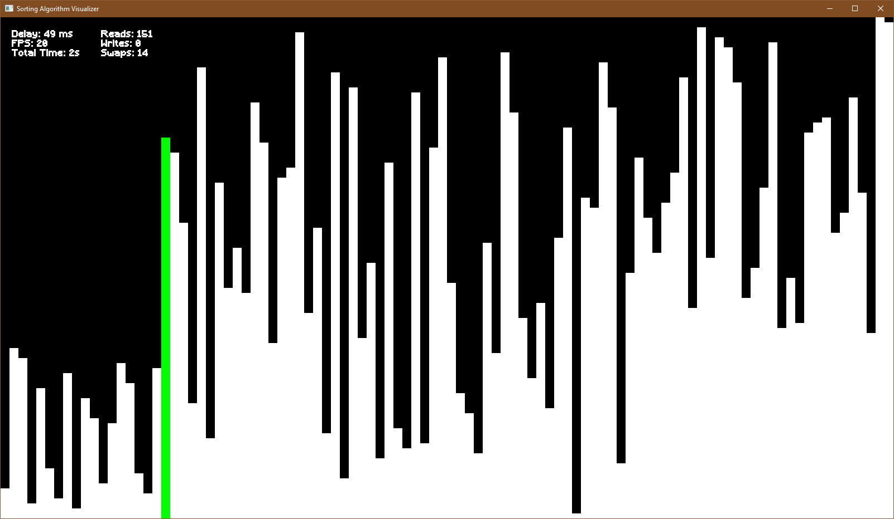
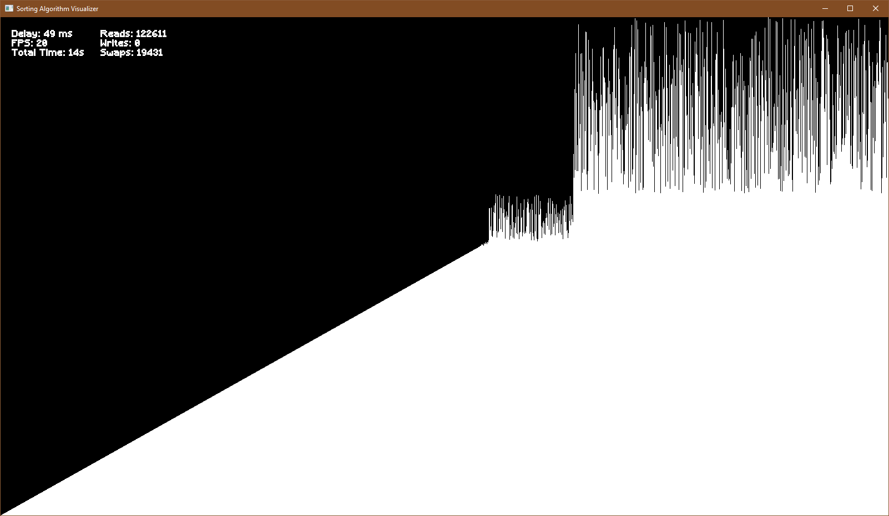

# Algorithm Visualizer in C++

A sorting algorithm visualizer made in C++ using SFML, which can display the inner workings of any sorting algorithm, that can be made in C++. The purpose of this project is to act as a visual aid to better understand sorting algorithms, and to personally teach myself a new framework.

<p align=center>

<i>Example of how it looks like with only 100 elements</i>
<br>
<br>

<i>Example of how it looks like with 10000 elements (works slowly, because of built-in delay)</i>
</p>

## Building

This project was made with SFML (which is included), and Visual Studio. To launch this, first clone the repo.

```bash
gh repo clone SleepiCaffeine/AlgoVisualizer
# Alternatively:
git clone https://github.com/SleepiCaffeine/AlgoVisualizer.git
```
Then open the `AlgoVisualizer.sln` using Visual Studio.
Once opened, build and run the project, and enjoy.

## Notes

- This was done as a personal challenge to self-teach an entirely new framework from scratch, I had no prior experience with any UI libraries in C++, and thus this code is not entirely optimal.
- I will not be revising this anytime soon, so any bugs that are present will not be fixed.
